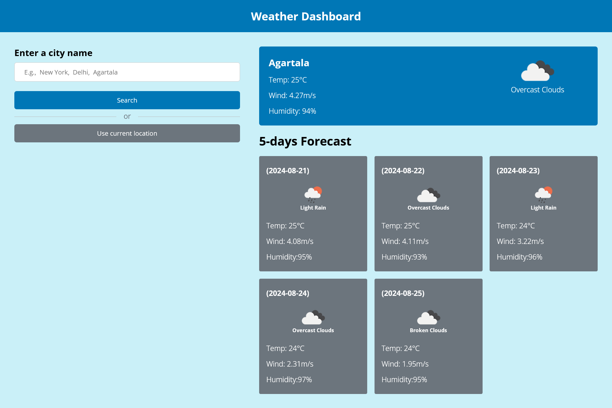

# Weather-App
A responsive website that shows the weather and 5-days forecast of any city or current user location.

### Screenshot

#### Mobile Design

#### Web Design

### Links
- Live Site URL: (https://creative-torrone-56d84b.netlify.app)

### Built with

- Semantic HTML5 markup
- CSS
- Mobile-first workflow
- Javascript(ES6)
- [APIs](https://openweathermap.org/api)

### Useful resources

- [Resource 1](https://www.youtube.com/@KevinPowell) - This channel helped me a lot to understand and improve my CSS skills.
- [Resource 2](https://www.youtube.com/playlist?list=PLu71SKxNbfoBuX3f4EOACle2y-tRC5Q37) - This is the best playlist for anyone learning Javascript. His immense teaching gave me confidence to use and implement JS efficiently.

